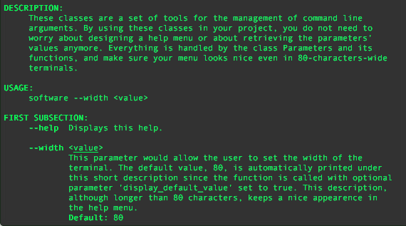

# Help80

The classes defined in this project can be used for parameters parsing and display, while making sure the help menu looks nice on terminals. The name comes from the default width of terminals. Indeed, most terminals have a default width of 80 characters.

### Features

Help80 allows you to:
* parse the command line arguments
* automatically design a help menu that fits the terminal's width
* make sure all the input arguments respect the size of the built-in type you assign them to 

### Use

To use the classes in your own project, just include the files [*Parameters.hpp*](src/Parameters.hpp) and [*Parameters.cpp*](src/Parameters.cpp) in your project.

Supported types:
* `std::string`
* `int`
* `long int`
* `long long int`
* `unsigned long int`
* `unsigned long long int`
* `float`
* `double`
* `long double`

Note:
* type `bool` is reserved for parameters with no value
* type `std::string` can be used, but is also used for multiple choices parameters

#### Create the `Parameters` object

When you create the `Parameters` object, you need to pass a `Parameters::config` structure to its constructor. This structure defines all the indentation and dimensions of the help menu. The structure has the following fields:
1. `const int max_terminal_width`: the maximum width that the help menu can take. If the terminal is full screen, using 100% of its width can lead to long lines that are hard to read. This parameter should be around 90-120.
1. `const int params_indent_len`: number of characters between the left side of the terminal and the list of parameters.
1. `const int param_to_desc_len`: minimal number of characters between the end of a parameter's name and its description. If this space is not respected, the description begins on a new line.
1. `const int desc_indent_len`: number of characters between the left side of the terminal and the paragraph that describes the parameters.
1. `const int choice_indent_len`: indentation of the available choices for multiple choices parameters.
1. `const int choice_desc_indent_len`: indentation of the choices' description from the choice's name.
1. `const int right_margin_len`: number of characters between last character on screen and right side of the terminal.
1. `LANG      lang`: (`lang_fr` or `lang_us`) this allows to adapt to the differences of these two languages. 

Then two constructors are available:
* `Parameters(const int, char const* const* const, config)`: the help menu width will be the minimum between `max_terminal_width` and the terminal's width.
* `Parameters(const int, char const* const* const, config, const int)`: the help menu width will be the minimum between `max_terminal_width` and the value given by the constructor's fourth argument.

When the object is created, you can start defining parameters. This will automatically start building the help menu.

#### Specify the parameters
        
First you can specify a description of your program, and how to use it with the functions:
* `set_program_description(const std::string&)`
* `set_usage(const std::string&)`
 
Then you can use the following functions to define your program's parameters:
* `define_param` : to define a parameter that doesn't need any value. This function takes two arguments, listed below:
  1. `const std::string&`: the parameter's name.
  1. `const std::string&`: its description.
* `define_num_str_param`: to define a numeric or `std::string` parameter:
  1. `const std::string&`: the parameter's name.
  1. `const std::vector<std::string>&`: the name of the associated values. This is what will be written between `<` and `>`, like `<value1>` next to the parameter's name.
  1. `const std::vector<T>&`: the default values associated with the above names.
  1. `const std::string&`: the parameter's description.
  1. `const bool=false`: specifies if the default value has to be printed. This will mean to the user that if he does not specify this argument, the default value will be used.
* `define_choice_param`: to define a multiple choice parameter. This is a parameter that can only take a finite set of (`std::string`) values:
  1. `const std::string&`: the parameter's name.
  1. `const std::string&`: the name of the associated value.
  1. `const std::string&`: the default choice.
  1. `vec_choices`: a vector of `std::pairs<std::string, std::string>` where the `first` element is the choice's name, and the `second` element is the choice's description.
  1. `const std::string&`: the parameter's decription.
  1. `const bool`: specifies if the default choice has to be printed.

The order in which you define the parameters will be the same as the order of the parameters on the help menu. You can add structure by adding subsections between parameters with function `insert_subsection(const std::string&)`.

When the menu is ready, you can print it with if you wish with `print_help()`. This function is usually only called when asked by the user though.
        
#### Get the entered values

So far, the parameters have only been defined. After a call to `parse_params()` the command line arguments will be parsed and the parameter's values will be updated from their default value to the one provided by the user. If no exception is thrown so far, the command line is correct. You can then use the following functions to retrieve the parameters' values:
|function | description |
|---------|-------------|
|`is_spec(const std::string&)` | to know if a simple parameter is specified.|
|`num_val(const std::string&, const int=1)` | to get the n-th numeric value of a numeric parameter. The first one is accessed with index 1, the default value.\
|`str_val(const std::string&, const int=1)` | to get the value of a `std::string` parameter. The first one is accessed with index 1, the default value.|
|`cho_val(const std::string&)` | to get the value of a multiple choice parameter.|

#### Catch the following exceptions

Along the way, exceptions can be thrown. They mean something bad was entered by the user:
* `ValueOutOfRangeException`: thrown if the value given by the user is not in the range of the built-in type specified by the coder.
* `NotEnoughValuesException`: thrown when the command line doesn't have as many arguments as required.
* `DecimalExpectedException`: thrown when a decimal value is expected but something else is given by the user.
* `IntegerExpectedException`: thrown when an integer value is expected but something else is given by the user.
* `UnknownParameterException`: when there is an unknown parameter in the command line.

They can also mean something was badly coded (by the coder):
* `UndefinedValueException`: when you are trying to access (n+1)-th value of a parameter that only has n values.
* `UnsupportedParameterTypeException`: when you try to create a parameter of (so far) unsupported type.
* `DuplicateParameterException`: when you try to create a parameter with an already existing name.
* `UndefinedParameterException`: when you try to retrieve value for a parameter that doesn't exist.

***

### Guarantees

These classes guarantees the following things if no exception is thrown:
* The command line entered by the user only calls defined parameters, with acceptable values.
* The parameters you defined and how you use them is correct.

However, there is no guarantee that:
* The input parameters specified by the user are compatible. It is possible that a combination of parameters doesn't make sense in your program. This is your task to check this kind of incompatibilities.
* The values for the parameters are acceptable for your application. They respect the size of the built-in type, but if you want to make sure a value is not above 100 or below 50, this is also your job.

***

### Example

The file [*main.cpp*](src/main.cpp) provides an example of how to use this project. Here is the output of the `print_help()` function. No formatting is made by the user:

	These classes are a set of tools for the management of command line arguments.
	By using these classes in your project, you do not need to worry about designing
	a help menu or about retrieving the parameters' values anymore. Everything is
	handled by the class Parameters and its functions, and make sure your menu looks
	nice even in 80-characters-wide terminals.

	USAGE:

		software --width <value>

	FIRST SUBSECTION:

		--help             Displays this help.

		--width <value>    This parameter would allow the user to set the width of
                      	   the terminal. The default value, 80, is automatically
                      	   printed under this short description since the function is
                      	   called with optional parameter 'display_default_value' set
                      	   to true. This description, although longer than 80
                      	   characters, keeps a nice appearence in the help menu.
                      	   Default: 80

		--multiple <v1> <v2> <v3>
                      	   This parameter expects three values. Since the parameter's
                      	   name and the list of values is a long string, this
                      	   description paragraph is printed on a new line. Default
                      	   values are defined but aren't listed below.

		--mode <choice>    You can also define multiple choices parameters. You need
                      	   to give the multiple choices in an array of pairs (choice,
                      	   choice_description):
                         	   "first_mode": this mode is the first available mode.
                                       	     The description of the choices also fits
                                       	     in the terminal.
                         	   "second_mode": this mode is another available mode.
                                        	  This is the default mode, as printed
                                       	      just below.
                         	   "third_mode": the third mode. If_there_is_a_really_long
                                       	     _word_that_wouldnt_fit_on_one_line_it_is_
                                       	     split_at_the_end_of_this_line_and_this_wo
                                       	     rks_on_multiple_lines.
                         	   "fourth_mode_super_long": last one.
                                                  	     If_there_is_a_long_word that
                                                   	     would fit on the next line,
                                                   	     it goes on the next line.
                      	   Default: "second_mode"

	SECOND SUBSECTION:

		--first_option     You can also define parameters with no values, just like
                      	   this one. No default value is printed.

		--second_option    If there is_a_really_long_word_that_wouldnt_fit_on_one_lin
                      	   e_it_is_split_at_the_end_of_this_line_and_this_works_on_mu
                      	   ltiple_lines.

		--third_option     If there
                      	   is_a_really_long_word_that_would_fit_on_the_next_line it
                      	   goes on the next line.

		--fourth_really_long_option
                      	   If there is_a_really_long_word_that_wouldnt_fit_on_one_lin
                      	   e_it_is_split_at_the_end_of_this_line_and_this_works_on_mu
                      	   ltiple_lines.

		--fifth_really_long_option
                      	   If there
                      	   is_a_really_long_word_that_would_fit_on_the_next_line it
                      	   goes on the next line.

		--sixth_really_long_option
                      	   One_word.

		--seventh_really_long_option
                      	   Normal option.

***

### License

Help80 - Copyright (C) 2016 -  Olivier Deiss

This program is free software: you can redistribute it and/or modify
it under the terms of the GNU General Public License as published by
the Free Software Foundation, either version 3 of the License, or
(at your option) any later version.

This program is distributed in the hope that it will be useful,
but WITHOUT ANY WARRANTY; without even the implied warranty of
MERCHANTABILITY or FITNESS FOR A PARTICULAR PURPOSE.  See the
GNU General Public License for more details.

You should have received [a copy of the GNU General Public License](COPYING)
along with this program. If not, see <http://www.gnu.org/licenses/>.

***

### Contact

olivier . deiss [at] gmail . com
